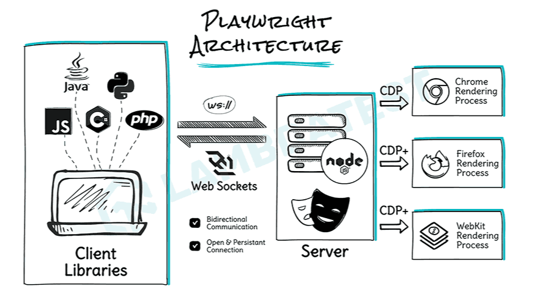
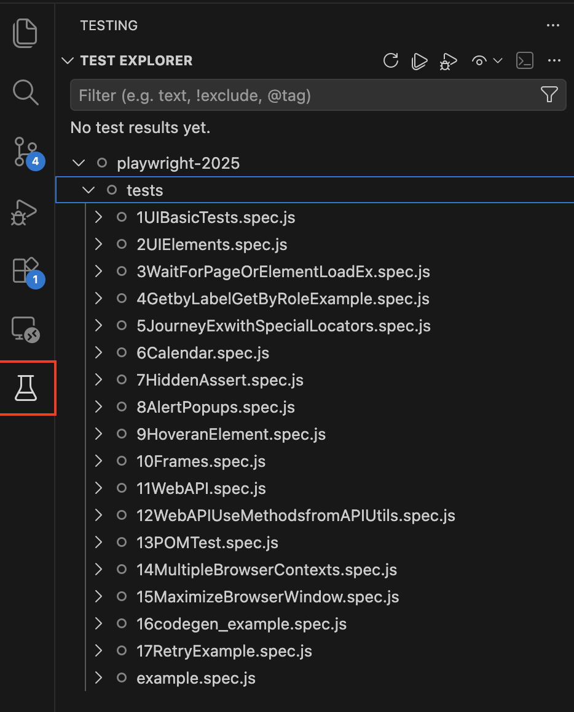
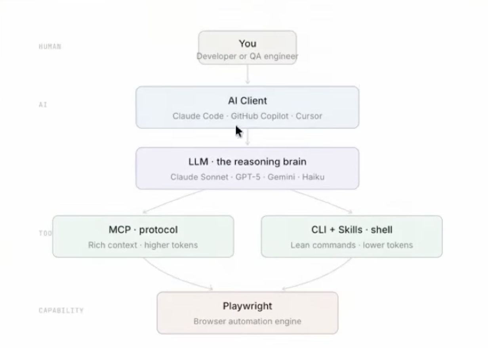

****Playwright Notes****  
===============================  
  
**Course: Rahul shetty**  
++[https://thoughtworks.udemy.com/course/playwright-tutorials-automation-testing](https://thoughtworks.udemy.com/course/playwright-tutorials-automation-testing)++  
  
**Mukesh Otwani (crash course 8 hrs):**[https://www.youtube.com/watch?v=pq20Gd4LXeI](https://www.youtube.com/watch?v=pq20Gd4LXeI)   
  
**Why Playwright**1. Reliable End to End testing - Autowait capability  
[https://playwright.dev/docs/actionability](https://playwright.dev/docs/actionability)  
2. Cross browser compatibility - Supports all major browsers chromium, edge, Firefox, safari, opera  
3. Multi platform support - runs on windows Mac linux also supports native mobile emulation for chrome on android & safari on iOS  
4. Multi language support - JS, TS, Python, Java, C#  
  
**Advance Features:**1. Tracing & Debugging - Screenshots, Logs, Recordings (Playwright Test runner)  
2. Network Interception - Using Playwrights API testing library  
3. Browser Context Mgmt - We can save and transfer browsers state to other tests,   
Ex: u can do login in normal window, copy that context and open a incognito window that has user already logged  
4. Codegen tool - Generates test code by recording our actions ( record & playback)  
  
**Why Playwright is faster:**Webdriver - Test Script → WebDriver Client → WebDriver Server → Browser Driver → Browser (HTTP - client/server)  
Playwright** **-** **Test Script → Playwright → Browser (websocket) - No concept of drivers here  
*Playwright eliminates the WebDriver server layer and communicates directly with the browser via DevTools/WebSocket, while also providing auto-waiting, live locators, and lightweight parallel execution.*  
**[https://www.linkedin.com/pulse/interview-373-playwright-do-you-know-architecture-rgqdc/](https://www.linkedin.com/pulse/interview-373-playwright-do-you-know-architecture-rgqdc/) **  
  
  
****Setup:****  
You need NodeJS (Install node)  
Editor : VS code  
  
Create a new folder(project name)  
npm init playwright  
  
**@playwright/test** - module - launches the browser and provides a fresh page to each test.  
const {test,expect} = require('@playwright/test');  
  
**Fixtures**  
Playwright provides several built-in fixtures out of the box:   
* page: A Page object representing a single browser tab, ready for interaction.  
* context: A BrowserContext object, acting like an isolated incognito session.  
* browser: A Browser instance (Chromium, Firefox, or WebKit).  
* request: An APIRequestContext for making direct HTTP calls to the backend (useful for API testing or fast setup).  
* browserName: A string indicating which browser the test is currently running in.   
You can create custom fixtures as well by extending default playwright test   
Real time usage: to perform Login before every test, you can have a fixture.  
  
****To Run Tests****  
  
**npx playwright test**  
Runs the end to end tests  
  
**npx playwright test —project=chromium**  
Run tests for a specific file.  
  
**npx playwright test tests/example.spec.js**  
Runs a specific file  
  
**npx playwright test —debug**  
Runs the tests in debug  
  
**By default tests run in Headless**  
In config update to   
Use{  
headless: false,  
}  
Or Run like below  
**npx playwright test tests/example.spec.js —headed**  
  
**How to use playwright code generator **  
npx playwright codegen <URL of the website> -o <path to the spec.js file to store code>  
npx playwright codegen https://www.amazon.in -o ./tests/codegen_example.spec.js  
  
**npx playwright test --ui**  
Open Playwright test runner  
  
**npx playwright show-report**  
To show the test report of latest execution  
**BASE_URL=https://www.jobcurator.in npx playwright test tests/22BaseURL.spec.js**To pass BASE_URL of environment during test execution  
  
****To Run tests in Parallel****  
—> Method 1  
Add this in test spec  
test.describe.configure({ mode: 'parallel' }); // only that specific test will run parallel , default mode 'serial'  
  
—> Method 2  
In config file that opens no of workers mention below  
workers: 4, //no of threads in parallel  
fullyParallel: true, // each test in spec file is run independently  
  
  
**Use Custom Config file , not the default one**  
npx playwright test tests/25TestDataFromFixture.spec.js --config playwright-safari.config.js   
  
**Use projects feature in config file**  
Using this we can setup execution on multiple browsers like chrome, safari in 1 config file.   
Config file will look like thisprojects:[  
    {  
      name: "safari",  
      use: {  
      browserName: 'webkit',  
      headless: true,  
    }  
  },  
  
      {  
      name: "chrome",  
      use: {  
      browserName: 'chromium',  
      headless: true,  
    }  
  }  
  
While executing we can pass project to the command  
npx playwright test tests/25TestDataFromFixture.spec.js --config playwright-multiple-projects.config.js --project=safari  
  
  
****How do you Locate elements****  
const userName = await page.locator("#username");    
  
**How do you Locate Multiple Elements - List of elements**  
1. **Method using locator.all()**  
  //wait until all 37 options loaded in dropdown  
  await expect(page.locator("#state option")).toHaveCount(37);  
  //get list of elements method1  
  const states = await page.locator("#state option").all(); //gets all states  
  console.log("States count: "+states.length);  
  for(const state of states){  
    console.log(await state.textContent());  
  }  
 2. **Method using page.$$** let state = await page.$("#state"); //gets state dropdown 1st states = await page.$$("option") //gets all options in the dropdown	console.log("States count: "+states.length);  for(const state of states){    console.log(await state.textContent());  }  
  
  
  
****Locators & actions:****  
1. **Get a element using a locator**const userName =  page.locator("#username");    
2. **To enter text in textbox**await userName.fill("sriramkukkadapu@gmail.com");  
3. **Select a option from dropdown**await dropdown.selectOption("Consultant");await page.locator('select#country-dropdown').selectOption({ label: 'India' }); await page.locator("#state").selectOption({value: 'Goa'});await page.locator("#state").selectOption({index: 4});Prefer to use label always - because developer might change value and index  
4. **Select Multiple options from drop down**await page.locator("#hobbies").selectOption(['Singing','Dancing']);  
5. **How to get the Selected Option from drop down:1. Using input value method:**console.log( page.locator('#state').inputValue());**2. Using locator.evaluate method**   const dropdownLocator = page.locator('#state');const selectedOptionText = await dropdownLocator.evaluate(   (selectElement) => {    const index = selectElement.selectedIndex;    const optionSelected = selectElement.options[index];    return optionSelected.textContent;  });  console.log("Selected text from State dropdown: "+selectedOptionText);  await expect(selectedOptionText).toEqual('Bihar');  
6. **Get all selected options from a multiselect dropdown**  dropdownLocator = page.locator("#hobbies");let optionsSelected = await dropdownLocator.evaluate(   (selectElement) => {    const elements = selectElement.selectedOptions;    const selectedValues = [];    console.log("Options selected: "+elements.length);    for(let i=0;i<elements.length;i++){      selectedValues.push(elements[i].textContent);    }    return selectedValues;  });  
7. **Click a button/Select a checkbox**await userCheckbox.click();  
8. **Verify if checkbox is checked**await expect(userCheckbox).toBeChecked();  
9. **Verify if checkbox is unchecked**expect(await terms.isChecked()).toBeFalsy();  
10. **Check if a attribute is present for a element**expect(documentsLink).toHaveAttribute("class","blinkingText");  
11. **Get a text from a Label/Div/Span**const text = await page.locator("#username").textContent();  
12. **Get a Value from a Input Field/Textbox which is filled dynamically **await page.locator("#username").inputValue()  
13. **Get a list of Text contents for a Locator - Ex: Fetch all titles of product cards**const titles = await page.locator(".card-body h5 b").allTextContents()  
14. **Find a element matching with given text - this locator specially given by playwright**await page.locator("text=Checkout").click();  
15. **Type sequentially in the textfield we can mimic like how a real user types in the textfield. there is a method called: pressSequentially**wait page.locator("input[placeholder='Select Country']").pressSequentially("India");  
16. **Select a radio button/Check a checkbox **await page.locator("//…locator").check();  
17. **GoBack to previous page**await page.goBack();  
18. **Forward to the next page**await page.goForward();  
19. **Check an element is visible**await expect(page.locator("#displayed-text")).toBeVisible();  
20. **Check an element to be hidden**await expect(page.locator("#displayed-text")).toBeHidden();  
21. **Move to an Element / Hover an element:**await page.locator("#mousehover").hover();  
22. **When 2 elements shown with 1 locator - 1 is visible and 1 is hidden, to click on only visible one.**subPage.locator("li a[href='lifetime-access']:visible").click();  
23. **Focus on element:**await page.locator("input[placeholder='Search the web']").focus();  
  
  
****Maximize screen/window****  
1. **In config file add below.**  projects: [  
    {  
      name: 'chromium',  
      use: { ...devices['Desktop Chrome'],   
         viewport: {width:1728, height:864}  
      },  
    }]  
2. **In test file you can explicitly mention this before test starts:**test.use({viewport: {width: 1500, height: 700}});  
  
  
****Launch Browser Maximum Screen Size every time when test runs:****  
In config:  
use: {  
    baseURL: process.env.BASE_URL || 'http://www.google.com',  
    /* Collect trace when retrying the failed test. See https://playwright.dev/docs/trace-viewer */  
    browserName: 'chromium',  
    // browserName: 'firefox',  
    // browserName: 'webkit',  
    headless: true,  
    screenshot: 'on', //only-on-failure, off  
    trace: 'on', //retain-on-failure  
    video: 'on',  
**    viewport: null,**  
**    launchOptions: {**  
**      args: ["--start-maximized"],**  
**    }**  
  }  
  
  
****Ignore HTTPs certificate errors while launching browser:****    ignoreHttpsErrors: true,  
  
**Allow Geo location sharing permission while launching new browser:**  
    Permissions: ['geolocation'],  
  
  
****Child Window Handling:****  
await page.goto("https://rahulshettyacademy.com/loginpagePractise/");  //go this this page  
 const documentsLink = page.locator("a[href*='documents']"); // //a[contains(@href,'documents')]"); //link which will open new page  
 const [newPage] = await Promise.all([ //all actions inside this gets executed in parallel  
     context.waitForEvent('page'), //wait for new page to be created  
     documentsLink.click() //clicking this opens new tab/page  
    ]) //  
//Now validate things on new pageconst redTextOnNewPage = newPage.locator("p[class='im-para red']");  
const text = await redTextOnNewPage.textContent()  
console.log(text);****Wait for the Last element to be Loaded on the page****Consider in this scenario I want to wait for the last product to be listed on the page. It waits for all the items listed with this locatorawait page.locator(".card-body h5").last().waitFor();  
await page.locator(".card-body b").last().waitFor( {state: 'visible'});  
  
  
**Pause Execution during run time:**await page.pause(); //opens debugger during run time  
await page.waitForTimeout(2000); //— hard wait for this time - not recommended  
  
  
**Get all list of elements matching a locator and display the text**  
const allListItems = page.locator('ul > li');  
const items = await allListItems.all(); *// items is an array of locators*  
for (const itemLocator of items) {  
    console.log(await itemLocator.textContent());  
    *// You can also perform actions on each item:*  
    *// await itemLocator.click(); *  
}  
  
**Add Explicit WaitFor an Element in Playwright script:**await page.locator("div li").waitFor();  
await page.locator("div li").first().waitFor();  
await page.locator("div li").last().waitFor();  
await page.locator("div li").last().waitFor();  
await page.locator("div li").nth(3).waitFor(); //wait for 3rd element  
Wait for state visible:await page.locator("div li").last().waitFor( {state: 'visible'});  
  
**Playwright special locators**  
page.getByAttribute  
page.getByAltText  
page.getByLabel - await page.getByLabel("Employed").check();  
page.getByPlaceholder - await page.getByPlaceholder("Password").fill("Test1234!");  
page.getByRole - await page.getByRole("button", {name: "Submit"}).click();   
page.getByTestId  
page.getByText - await page.getByText("Success! The Form has been submitted successfully!.")  
page.getByTtitle  
  
**Chaining the locators example:**await page.locator("app-card").filter({hasText: "iphone X"}).getByRole("button", {name: "Add"}).click();  
  
**Alert Popups - How to handle in playwright**  
1) Alert dialog  
//1st add the event in the script  
    page.on("dialog", dialog => {  
        console.log(dialog.message());  
        dialog.accept(); // (or)  dialog.dismiss(); - to reject the pop-up  
    });  
//then add code to click the button that pops up the alert  
await page.locator("#alertbtn").click();  
2) Confirm Dialog  page.on("dialog", d => {  
        console.log(d.type());  
        console.log(d.message());  
        expect(d.type()).toContain("confirm");  
        expect(d.message()).toEqual("I am a JS Confirm");  
        d.accept();  
    })  
    await page.getByRole("button", {name: "Click for JS Confirm"}).click();  
3) Prompt Dialogpage.on("dialog", d => {  
        console.log(d.type());  
        console.log(d.message());  
        expect(d.type()).toContain("prompt");  
        expect(d.message()).toEqual("I am a JS prompt");  
        d.type("Test Input");  
        d.accept();          
    })  
    await page.getByRole("button", {name: "Click for JS Prompt"}).click();  
  
  
  
  
**Frames Example:**    await page.goto("https://rahulshettyacademy.com/AutomationPractice/");  
    const subPage = page.frameLocator("#courses-iframe"); //place where frame present  
    subPage.locator("li a[href='lifetime-access']:visible").click(); //use new subPage as the page to access in frame  
    const text = await subPage.locator(".text h2").textContent();  
    console.log(text);  
    console.log("No of Subscribers: "+text.split(" ")[1].trim());  
  
**Calling API's using Playwright**  
const loginPayload = {"userEmail":"sriramkukkadapu@gmail.com","userPassword":"Test1234!"};  
//Login API  
    const loginResponse = await apiContext.post("https://rahulshettyacademy.com/api/ecom/auth/login", {  
        data: loginPayload  
    });  
  
expect(loginResponse.ok()).toBeTruthy();  
  
const createOrderPayload = {"orders":[{"country":"Cuba","productOrderedId":"6960eac0c941646b7a8b3e68"}]};  
//Create Order API  
        const orderResponse = await apiContext.post("https://rahulshettyacademy.com/api/ecom/order/create-order", {  
        data: createOrderPayload,  
        headers:{  
                    'authorization': token,  
                    'content-type': 'application/json'  
        }  
    });  
  
expect(orderResponse.ok()).toBeTruthy();  
  
  
**How to configure Retries when tests fail:**In config file add:   retries: 2,  
  
**Playwright Test for VSCode Extension**  
In VS code there is a Playwright test extension using this we can directly run tests using VS code editor itself directly.It gives a new Tab in VS code editor where we can view all the tests and run them.  
  
  
**How to upload file in Playwright?**1. Single file	await page.locator("#file-upload").setInputFiles("/Users/sriram.kukkadapu/projects/playwright-2025/upload_file.png");  
2.Multiple files	await page.locator("#file-upload").setInputFiles("file1.txt", "file2.txt");**How to download files in Playwright?**const [download] = await Promise.all([  
  page.waitForEvent('download'),  
  page.click('#downloadBtn')  
]);  
await download.saveAs('downloads/report.pdf');console.log(await download.suggestedFilename());  
console.log(await download.path());  
//verify downloaded path is not null  
const path = await download.path();  
expect(path).not.toBeNull();  
//verify file exists in that Parth  
const fs = require('fs');  
expect(fs.existsSync(path)).toBeTruthy();  
  
  
  
**How to Handle Multiple Tabs in PW (ex: clicking a link opens a new tab)?**  
    page.goto("https://freelance-learn-automation.vercel.app/login");  
  
    const [newPage] = await Promise.all(  
      [  
        context.waitForEvent("page"),  
        page.locator("//a[contains(@href,'facebook')][1]").first().click()  
      ]  
    );  
      
    await newPage.locator("//input[@name='email' and @type='text']").fill("sriramkukkadapu@gmail.com");  
    await page.pause();  
})  
  
**How to Handle Autosuggestions in a Textbox (Amazon example):**await page.goto("https://www.amazon.in/");  
  await page.locator("input[id='twotabsearchtextbox']").type("iPhone");  
  
  // Wait for the suggestion container to appear  
  const suggestionContainer = page.locator('.autocomplete-results-container');  
  // await suggestionContainer.waitFor({ state: 'visible', timeout: 5000 });  
  await expect(suggestionContainer).toBeVisible({timeout:2000});  
  
  // All suggestion items     
  const suggestions_list = await page.locator('.s-suggestion-container .s-suggestion').allTextContents();  
  console.log("Suggestions list count: "+suggestions_list.length);  
  for(let i=0;i<suggestions_list.length;i++){  
      console.log("suggestion: "+suggestions_list[i]);  
  }  
  await page.locator("div[aria-label='iphone 17 pro']").click();  
    
**How to set BASE URL for Test Execution**  
//—> In Config file:use: {  
    baseURL: process.env.BASE_URL || 'http://www.google.com',  //(if any URL provided it will be assigned, if not by default google will open)  
    /* Collect trace when retrying the failed test. See https://playwright.dev/docs/trace-viewer */  
    browserName: 'chromium',}  
//—> In the script  
To go to BASE URL defined as per configawait page.goto('/');  
//—> Command while running to pass BASE URLBASE_URL=https://www.jobcurator.in npx playwright test tests/22BaseURL.spec.js  
  
  
  
**How to perform Keyboard events in PW?**  await page.keyboard.press("ArrowLeft");  
  await page.keyboard.down("Shift");  
  await page.keyboard.up("Shift");  
  await page.keyboard.press("Backspace");  
  
**How to Read TestData from a JSON file?**// file name : loginTestData.json****{  
    "email": "sriramkukkadapu@gmail.com",  
    "password": "Test1234!"  
}  
  
//importing & using data from above JSON file  
import testData from '../testData/loginTestData.json';  
	await page.getByPlaceholder("email@example.com").fill(testData.email);  
        await page.getByPlaceholder("enter your passsword").fill(testData.password);  
  
**How to Read & Use TestData(MultipleRows - Iterative Manner) from a JSON file**  
//file name: loginTestDataMultipleusers.json  
[  
    {  
    "email": "sriramkukkadapu@gmail.com",  
    "password": "Test1234!"  
    },  
    {  
    "email": "invalid@gmail.com",  
    "password": "Test1234!"  
    }  
]  
  
//importing & using data from above JSON file:  
import users from '../testData/loginTestDataMultipleusers.json';  
for(const user of users){  
test(`Login Test with User ${user.email}`, async ({page}) =>   
    {             
  
        await page.goto("https://rahulshettyacademy.com/client");    
        console.log("With user: "+user.email + " | Password: "+user.password);  
        await page.getByPlaceholder("email@example.com").fill(user.email);  
        await page.getByPlaceholder("enter your passsword").fill(user.password);  
        await page.getByRole("button", {name: "Login"}).click();  
  
        console.log(await page.title());  
    });  
}  
  
  
**How to pass Test data as a Fixture to Test in playwright**  
—> Test-base fixture file:import { test as base } from '@playwright/test';  
export const test = base.extend(  
    {  
        testDataForLogin: async ({}, use) => {  
            await use({  
                email: "sriramkukkadapu@gmail.com",  
                password: "Test1234!"  
            });  
        }  
    }  
)  
  
—> Test file:  
import { expect } from '@playwright/test';  
import { test as testWithFixture } from './utils/test-base';  
  
testWithFixture('End to end journey with Special locators', async ({page, testDataForLogin}) =>   
    {             
        await page.goto("https://rahulshettyacademy.com/client");    
        await page.getByPlaceholder("email@example.com").fill(testDataForLogin.email);  
        await page.getByPlaceholder("enter your passsword").fill(testDataForLogin.password);  
        await page.getByRole("button", {name: "Login"}).click();  
        console.log(await page.title());  
 });  
  
  
  
  
**How to do drag and drop in playwright?**  
// Using element.dragTo() methodconst source = page.locator('#draggable');  
const target = page.locator('#droppable');  
await source.dragTo(target);//Using Mouse down & up options:await page.locator('#source').hover();  
await page.mouse.down();  
await page.locator('#target').hover();  
await page.mouse.up();  
  
  
  
**How to double-click a button/element?**  
await page.getByRole('button', { name: 'Double Click Me' })**.dblclick()**;  
**How to right click on an Element in playwright?**  
await page.getByText('Item').click({ button: 'right' });  
  
**How to perform a "Shift + Right-click" in playwright?**  
await page.getByText('Item').click(  
{   
	button: 'right',  
	modifiers: ['shift']  
}  
);  
  
**How to Implement Tags in Tests**  
// specifying journey tag for below test  
test('@journey End to end journey with Special locators', async ({browser,page}) =>   
//While running  
npx playwright test —grep @journey  
Using this tags we can separate tests like smoke/reg and API/UI etc or module wise test cases as well.Multiple tags also we can provide  
  
  
  
**Use PageObjectManager as Fixture:**import {test as base} from "@playwright/test";  
import { LoginPage } from "./LoginPage";  
import { DashboardPage } from "./DashboardPage";  
export const test = base.extend({  
    poManager: async ({page}, use) => {  
        await use({  
            loginPage:     new LoginPage(page),  
            dashboardPage: new DashboardPage(page),  
        });  
    }  
});  
export {expect} from "@playwright/test";  
  
**Test:**import {test} from "./pageObjects/POFixture";  
test('End to end journey with Special locators', async ({ poManager }) =>   
    {            
        const { loginPage, dashboardPage } = poManager;  
        await loginPage.gotoLoginPage();  
        await loginPage.validLogin("sriramkukkadapu@gmail.com","Test1234!");  
        await dashboardPage.searchProductAndAddtoCart("ZARA COAT 3");  
});  
  
  
**Playwright MCP + Agents**  
MCP - Model context protocol. Used to communicate b/w LLMs and Extenral sources like excel files/jira tickets etc  
Agent(typically a <name>.agent.md file) = LLM + MCP server   
  
In the context of playwright how this looks:  
AI/LLM  **<->  ** MCP server (likeUSB type C port)   **<->**   Your Application  
  
Playwright MCP typically has the tools to interact with browser likeclicktype  
Close  
Press keynavigatehoverscroll etc  
These are all actions exposed by playwright MCP and our LLM will communicate like "click on a button" -> pw map will call respective action  
  
  
  
Playwright provides 3 built in Test agents (Agent Trio)  
 - Planner - explores app, analyses DOM, test goal and tcreates test plan  
 - Generator - Converts above test plan into Playwright tests, actions, assertions  
 - Healer - executes above tests and fixes failures  
  
Playwright version should be latest  
VS code should be > 1.105  
  
Steps to configure Playwright MCP + agents  
Create a new project   
npm init playwright@latest  
npx playwright init-agents --loop=vscode  
--loop=vscode => this tells pw agents mode to communicate with vs code based agents like copilot,kiro etc.below are the other loop modes supported--loop=claude — For Claude Code (terminal-based agent)  
--loop=cursor — For Cursor IDE  
--loop=windsurf — For Windsurf IDE  
  
After running above command 3 agents will be downloaded in .github/agents folder  
.github/agents  
	-> playwright-test-planner.agent.md  
	-> playwright-test-generator.agent.md  
	-> playwright-test-healer.agent.md  
  
Prompt:  
You can give below Prompt to LLM so that I can configure everything for us.Initialize a new playwright project with MCP agents for VS code integration. Install necessary dependencies including @playwright/test and browsers.  
And run the seed test to validate the setup and start MCP server for local testing.  
  
Command LLM uses to start MCP server:npx playwright run-test-mcp-server  
  
  
Workflow:  
AI Agent(LLM)  →  via MCP Protocol  →  Playwright MCP Server  →  Browser(Your app)  
            (tool calls via JSON-RPC)  
Playwright runs as an MCP server (background process)  
Agent communicates via MCP tools like mcp_playwright_browser_click, mcp_playwright_browser_snapshot  
Configured in mcp.json or similar  
  
Now Use Kiro IDE:  
Activate agents that are in .github/agents - 3 agents will be there planner, generator and healer.  
seed.spec.js file - agent performs this steps to go to particular page and the start generating tests from that state.Ex: in seed.spec.js you can have code for launching url, performing login etc. Agent will perform these steps 1st and then generate tests post these steps.  
  
  
++Sample Prompt to give to LLM for asking it to create Testplan and generate test cases:++I need to write a new test for the OrangeHRM dashboard.   
[https://opensource-demo.orangehrmlive.com/](https://opensource-demo.orangehrmlive.com/)  
Please act as the Orchestrator and follow this strict lifecycle:  
First, read the rules in @playwright-test-planner.agent.md. Analyze the target page and output a step-by-step strategy for the test. Stop and wait for my approval.  
Once I approve the plan, switch your context to @playwright-test-generator.agent.md. Use those specific guidelines to write the actual Playwright Javascript code based on the plan.  
After you write the code, I will execute the test locally. If the test fails and I paste an error log into this chat, immediately assume the role of @playwright-test-healer.agent.md to analyze the trace and patch the code. Before generating tests - Ensure a playwright.config.ts exists in the project root. If it does not, create one with testDir pointing to the test output directory. This is required for the VS Code Playwright Test Explorer to recognize test cases.  
  
++Once we give above prompt ++  
1. LLM will talk to pw agents and pw agent will open browser in background in headless mode and analyses the app, dom structure and creates test planIt will generate test plan and wait for our approval. Approved!  
2. LLM will switch context to generator agent and will generates the test scripts for testcases defined in the testplan. It will wait and say "tests generated" and do you want me to run them.say yes run them for me.  
3. If tests fail LLM will say "Tests failed" switching to Healer context and it will analyze failures and fixes them.  
++Disadvantages/Risks with AI writing tests++  
1. Test Explosion - > AI makes it look easy to write tests but some times it may bloat up the suite with more unwanted tests, overlapped suites and it will create bottlenecks in CI pipelines.  
2. Hallucinations -> Agents occasionally invent elements or misinterpret the DOM resulting in "Green" tests that assert the wrong things.For ex: if I am writing a test to book a flight from Bangalore to hyd in case if the dropdown doesn't have Bangalore AI might add it using JS code and continue the test and it will pass. But at an end user level it is a BUG.  
3. Business Logic Gaps -> AI might not understand Business gaps/limitations/edge cases. It might miss few things.  
  
So due to above reasons we always need to have Human in the Loop  
  
  
**Playwright CLI**  
A command-line interface for browser automation designed for coding agents. Token-efficient commands and installable skills let agents balance browser automation with large codebases and reasoning within limited context windows.  
The primary difference between **Playwright CLI** and **Playwright MCP** lies in **where the browser state is stored and how it communicates with an AI agent**. [++[1](https://testdino.com/blog/playwright-cli-vs-mcp)++]  
* **Playwright CLI** acts like a remote control, running isolated shell commands and saving page snapshots and screenshots locally to disk.  
* **Playwright MCP (Model Context Protocol)** acts like a continuous conversation, streaming live browser data, accessibility trees, and screenshots directly into the LLM's context window.  
  

| Feature | Playwright CLI (@playwright/cli) | Playwright MCP (@playwright/mcp) |
| ---------------- | -------------------------------------------------------------- | ----------------------------------------------------------- |
| Data Storage | Saves snapshots and screenshots as local files on disk. | Streams data inline into the LLM context window. |
| Token Efficiency | Extremely high; average ~27,000 tokens per session. | Low; average ~114,000 tokens per session (up to 4x higher). |
| Interface Type | Standard terminal/shell commands (bash). | Structured tool calls via Model Context Protocol JSON. |
| Ideal Agents | Repository-aware coding agents (Claude Code, Cursor, Copilot). | Autonomous, sandboxed agents or custom orchestrators. |
| Best Used For | Fast test generation, CI/CD pipelines, bulk automation. | Dynamic UI exploration, self-healing tests, long reasoning. |
  
  
npm install @playwright/cli@latest  
npx playwright-cli --help  
  
The CLI downloads a browser automatically on first use. To install explicitly:  
playwright-cli install-browser               *# install default (chromium)*  
playwright-cli install-browser firefox       *# install specific browser*  
playwright-cli install-browser --with-deps   *# install with system dependencies*  
  
Install Skills for playwright cli:  
playwright-cli install --skills  
  
You need to use Claude code for this. Install Claude code in Terminal mode.  
You can give below prompt to the Claude code and it will use playwright cli to generate the Testcase.  
  
  
**TC-003: Cancel a single booking from the detail page.**  
Test data:  
Username: sriramkukkadapu@gmail.com, Password: Test1234!  
Preconditions: User is logged in "[https://eventhub.rahulshettyacademy.com/login](https://eventhub.rahulshettyacademy.com/login)"  
User has at least 1 confirmed booking  
  
Steps:navigate to 'https://eventhub.rahulshettyacademy.com/bookings'  
Click on cancel booking  
Click on confirm in dialog box "Yes, Cancel it"  
Observe redirect and bookings list.  
Expected result: Booking should be cancelled successfully and cancelled booking should no longer appear in the list.  
  
We can't use Claude code in Kiro-CLI because playwright CLI is developed for coding agents that run in terminal like Claude code, copilot, cursor etc.But Kiro-CLI also explored playwright-cli and did the Testcase generation.Just copy paste above prompt in Kiro-cli terminal and it did the thing. Mention below while pasting the prompt.Use playwright-cli skill to run the below test case.  
<use above prompt>  
  
While agent generates TC's meanwhile you can also see the execution happening   
**npx playwright-cli show**  
  
You can give prompt like below to generate automated test case.Use playwright-cli skill to run the below test case and generate automation script file for the same.  
<use above prompt>  
  
====================  
  
Javascript Fundamentals  
Until ES5 in JS we use var a=4 for storing variables  
From ES6 let, const are also supported  
  
**Difference between var and let is the scope**  
Let works only with in the block {}but var works across the function scope fully fun(){}  
  
Below is validvar a=4var a=sriram  
But below is invalid (error a is already defined)let a=4  
Let a=sriram  
  
We cannot redeclare variable with let but with var keyword you can redeclare it in the same scope.  
  
**What is use/diff b/w let/var and const?**const pi=3.14;You cannot change/reassign value for this variable. (Similar to final keyword in java)  
**How To know the type of a variable in java?**we can use typeof() method  
Ex: console.log(typeof(a))  
  
**Arrays:**var marks = Array(6);  
marks = new Array(35,70,65,78,99,45);  
marks = [35,70,65,78,99,46];  
  
How to add a new element to the JS array at the end?  
Ans: Using push method.   
marks.push(30);  //inserts at ending of the array  
How to add a new element to the beginning  of the array?Ans: marks.unshift(12);  //inserts at beginning  
  
Delete last element of array  
marks.pop();  
  
Find index of an element in array.marks.indexOf(12); // gives index of element 12 in array  
  
Find if an element present in array.marks.includes(12); //gives true if 12 present  
  
Create a sub array from main array  
marks.slice(2,6); //using slice method  
  
*// reduce*  
Get sum of all elements/multiplication of elements etc.   
var sum_reduce = marks.reduce((sum,mark) => sum+mark, 0) *//0 is initial value of sum, mark keeps changing*  
console.log("sum (using reduce): "+sum_reduce)  
  
*//filter - filter elements from array on a conditon*  
var scores = [12,13,14,16]; //from this filter all even elements  
var even_scores = scores.filter(score => score%2==0); *//elements matching condition will be stored and returned*  
console.log("even scores(using filter): "+even_scores);  
  
//map - update all elements in array as per given   
var scores = [12,13,14,16];  
var scores_doubled = even_scores.map(score=>score*2);   
O/p: [24,28,32]  
  
// You can also do chaining of above operations like below.  
// filter even now, multiple them by 2 and sum all of them.var chained_result = scores.filter(score => score%2==0).map(score=>score*2).reduce((sum,score)=>sum+score,0);  
  
//realtime examples of filter, reduce, map  
var usersJson = {  
    users: [  
        {  
            "name": "sriram",  
            "status": "active"  
        },  
        {  
            "name": "thripura",  
            "status": "active"  
        },  
        {  
            "name": "ishitha",  
            "status": "active"  
        },          
        {  
            "name": "raju",  
            "status": "inactive"  
        }  
    ]  
};  
  
const activeUsers = usersJson.users.filter(user => user.status === 'active');   
console.log("active users: ", activeUsers);  
console.log("active users count: " + activeUsers.length);  
  
*//reduce real time example*  
*// you are on cart page and you want to calculate and assert total of the products*  
var displayedTotal = 125.49;  
const itemPrices = [19.99, 5.50, 100.00];   
const calculatedTotal = itemPrices.reduce((accumulator, price) => accumulator + price, 0); *// 125.49*  
if(displayedTotal == calculatedTotal)  
    console.log("Total verified on cart page : success")  
else   
    console.log("Total verified on cart page : fail")  
  
  
*// map real time example*  
*// Example: Extracting visible text from a list of UI elements*  
*const productElements = await page.$$('.product-title');*  
*const productNames = await Promise.all(productElements.map(async (el) => await el.innerText()));*  
*Output: ['iPhone 15', 'Samsung S24', 'Pixel 8']*  
  
  
//real time example of chaining all of them  
*// to find all laptop prices sum*  
const inventory = [  
  { name: 'MacBook Pro', category: 'Laptop', price: 2000 },  
  { name: 'iPhone 15', category: 'Phone', price: 1000 },  
  { name: 'Dell XPS', category: 'Laptop', price: 1500 }  
];  
  
const totalLaptopCost = inventory  
  .filter(item => item.category === 'Laptop') *// 1. Isolate Laptops*  
  .map(item => item.price)                    *// 2. Extract their prices*  
  .reduce((sum, price) => sum + price, 0);    *// 3. Aggregate total sum*  
  
console.log("Laptop prices total: "+totalLaptopCost);  
  
  
//Sorting in arrays  
var fruits = ["banana","mango","apple","jackfruit"];  
fruits.sort();  
  
console.log("fruits sorted: "+fruits);  
fruits.reverse(); // reverse order  
  
var numbers = [4,9,0,2,10];  
console.log(numbers.sort());   
doesnt work it gives output as [ 0, 10, 2, 4, 9 ] because JS converts everything default to a string.  
  
So to sort above we need to provide sorting logic explicitly to sort() method  
  
var sorted_numbers = numbers.sort((a,b) => a-b); *//bubble sort min diff ele comes 1st*  
console.log(sorted_numbers);  
  
var sorted_numbers=numbers.sort((a,b) => b-a); *//bubble sort in descending order*  
console.log(sorted_numbers);  
  
//Functions   
*// function to add 2 numbers*  
function add(a,b){  
    return a+b;  
}  
console.log(add(2,3));  
  
*//anonymous functions without name*  
var sumOfIntegers = function (a,b){  
    return a+b  
}  
console.log(sumOfIntegers(2,3));  
  
*//anonymous functions simplified with => *  
var diffOfIntegers = (a,b) => a-b;  
console.log(diffOfIntegers(2,3));  
  
  
//=====Scope of let, var,const======  
//var is always global scope  
//let is block scoped  
  
//var example - global  
var greet = "evening";  
if(12==12){  
    var greet="afternoon";  
}  
console.log(greet);  
//o/p evening  
  
//let example - block scoped  
var greet = "evening";  
if(12==12){  
    let greet="afternoon"; //this variable is only valid in this block.  
}  
console.log(greet);  
//o/p afternoon  
  
  
//const - same as let but final => value cannot be changed  
const pi=3.14;  
try{  
pi=2.55; //=> this step is invalid because assigning to const variable  
}  
catch(e){  
    console.log("Invalid operation: "+e.message + " is not supported");  
}  
  
  
Strings:  
  
  
======================  
  
Use Page Objects as Fixtures.[https://www.youtube.com/watch?v=k488kAtT-Pw](https://www.youtube.com/watch?v=k488kAtT-Pw)  
  
Playwright mcp  
Naveen automation labs  
[https://www.youtube.com/watch?v=ld9gB348SEM](https://www.youtube.com/watch?v=ld9gB348SEM)  
Another video - slow and clear  
[https://www.youtube.com/watch?v=XcuvwueNGzo](https://www.youtube.com/watch?v=XcuvwueNGzo)  
  
Playwright cli  
Naveen automation labs:[https://www.youtube.com/watch?v=OaFmRHiKp68](https://www.youtube.com/watch?v=OaFmRHiKp68)  
  
  
  
  
  
  
  
  
  
  
  
  
  
  
  
